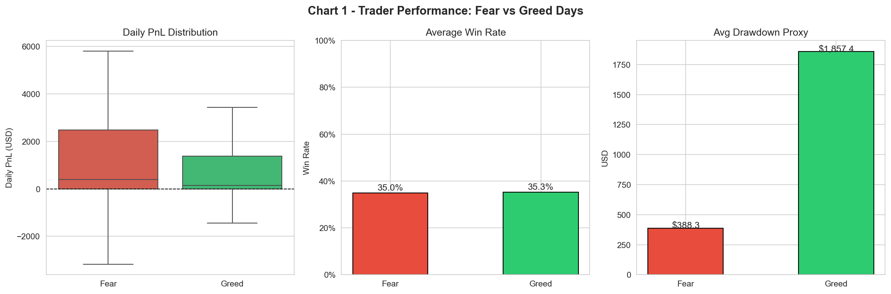
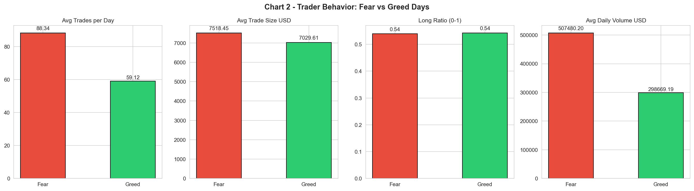
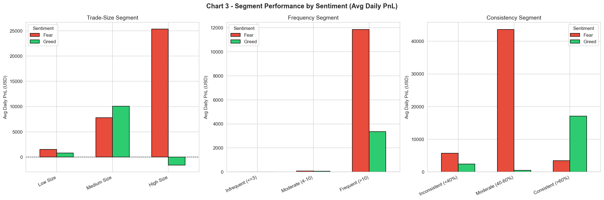
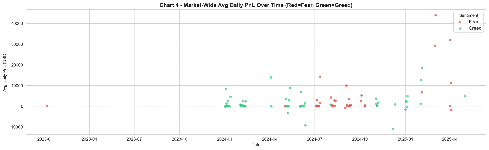
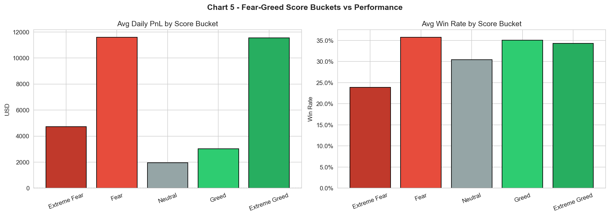

# Trader Performance vs Market Sentiment
**Hyperliquid DEX | Bitcoin Fear & Greed Index | 2023-2025**

---

## What this is

An analysis of ~211K trades across 32 Hyperliquid accounts, merged with daily Bitcoin Fear & Greed sentiment scores, to answer one question: does market sentiment actually change how traders behave and whether they make money?

The short answer is yes -- but the direction is not always what you would expect. Fear days produce higher mean PnL than Greed days, but that is largely driven by a few outsized wins. Greed days carry nearly 5x the drawdown risk.

---

## Setup

```bash
git clone https://github.com/yourusername/trader-sentiment-analysis
cd trader-sentiment-analysis

pip install pandas numpy matplotlib seaborn scikit-learn jupyter

# Add your data files to the root folder:
#   sentiment_regimes.csv
#   historical_data.csv

jupyter notebook Analysis.ipynb
# Kernel > Restart & Run All
```

---


## Key findings

- **Fear days (score 25-45) produce the highest mean daily PnL** ($11,333) : not Greed days ($3,192). Moderate fear creates better trading conditions, but this is skewed by a few large wins. The median tells a more honest story: $396 on Fear vs $147 on Greed.
- **Extreme Fear is genuinely bad** : median PnL of $0, win rate of 17.4%, yet traders run their highest long ratio (65.7%). Dip-buying in full panic conditions is not working in this dataset.
- **Greed days carry hidden risk** : average drawdown of $1,857 vs $388 on Fear days. Traders size up when confident, and sometimes get caught badly.
- **Traders are 49% more active on Fear days** : 88 trades/day vs 59 on Greed -- without a proportional increase in returns.
- **Win rate barely moves with sentiment** : 35.0% on Fear, 35.3% on Greed. Sentiment changes the size of outcomes, not the frequency of winning.


## Data

| File | Description | Rows |
|------|-------------|------|
| sentiment_regimes.csv | Daily Bitcoin Fear & Greed score + label | 2,644 |
| historical_data.csv | Hyperliquid trade executions | 211,224 |

The two datasets overlap from early 2024 onwards, giving 530 trader-day observations after merging.

## Charts

| Chart | What it shows |
|-------|---------------|
|  | PnL, win rate, drawdown: Fear vs Greed |
|  | How trader behavior shifts with sentiment |
|  | Segment performance broken down by sentiment |
|  | PnL over time colored by sentiment label |
|  | Numeric score buckets vs performance gradient |
